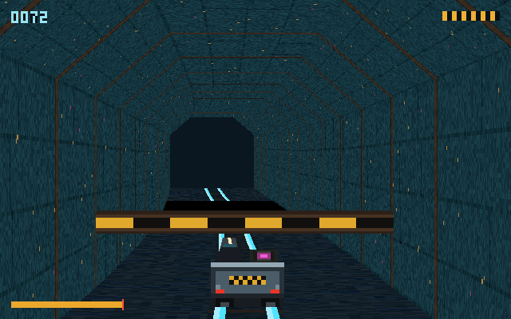
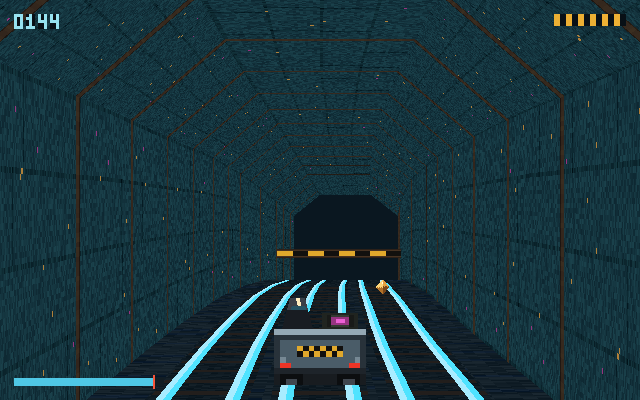
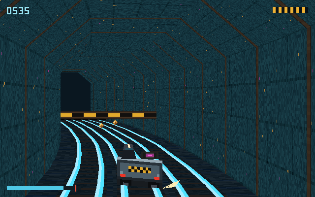
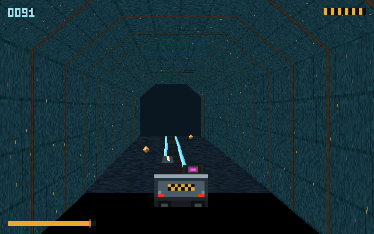
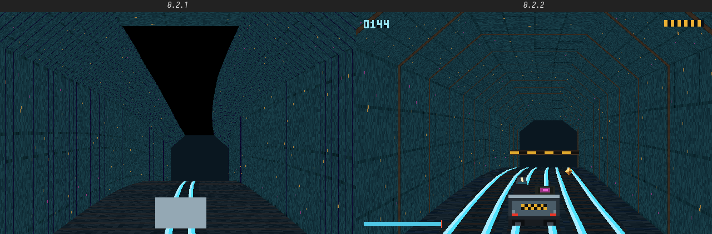

# cyrius-mine-cart — DEEPVEIN

Shaft 9 runs under a drowned arcology. You take the core, ride the rails down, and outrun what
follows. Textured, perspective-correct, rasterised by the AGNOS kernel's GPU.



This is the **first application outside the kernel's own test tree to draw with the AGNOS 3D ops**.
The kernel grew triangle rasterisation on real AMD gfx90c silicon over a long ladder of rungs —
edge coverage, barycentric colour, triangle lists, affine texturing, batched primitives, a depth
test, and finally perspective-correct interpolation — and every one of those rungs closed on a
proof binary. Proof binaries are the right way to build a rasteriser and the wrong way to know you
have one. This is the thing that was being built toward: a camera, a texture, a frame, on screen.

Written in [Cyrius](https://github.com/MacCracken/cyrius). No libc, no floating point, no external
dependencies. Every pixel goes through `#92 gpu_shader_op` op `0x0F`.

## Running it

```bash
cyrius build src/main.cyr build/mine-cart
./build/mine-cart --check
```

| Mode | What it does |
|---|---|
| *(default)* | Ride. Needs AGNOS and a GPU. Bounded to 900 frames (15 s) unless `--frames` says otherwise. |
| `--check` | The host gate — 242 self-test assertions, then 1080 frames built and every record re-validated the way the kernel would. Runs anywhere, needs no GPU. Exit 95 = pass. |
| `--verify` | One frame, GPU vs the CPU reference, byte-compared. Needs AGNOS and a GPU. |
| `--sim` | Run the simulation headless and print telemetry. The tuning instrument. |
| `--record F` | Ride (or `--sim`) and write every input word to `F`. |
| `--replay F` | Re-run a recorded ride headless. Exit 95 only if it reproduced exactly. |
| `--wav` | Render 20 s of the mix to `/tmp/deepvein.wav`, so a person can listen to it. |
| `--pilot N` | With `--sim` or `--wav`: 0 = hands off the controls, 1 = the reference autopilot. |
| `--frames N` | Bound the ride or the `--sim` run (0 = ride until ESC). |
| `--trace` | Report every dropped triangle, for diagnosis. |

**Controls:** A/D or the arrows lean, W or UP jumps, S or DOWN ducks, SHIFT brakes, ESC quits.

`cyrius tests` runs the same host gate through `tests/deepvein.tcyr`.

### Seeing it without a GPU

The game needs AGNOS iron to run, so the host tools draw it through `src/refcore.cyr`, a CPU
rasteriser that reproduces exactly what op `0x0F` is asked to draw:

| Tool | What it does |
|---|---|
| `tools/shot.cyr` | `shot [--pilot 0\|1] DIR FRAME...` writes screenshots (PPM) of the reference ride. |
| `tools/film.cyr` | `film [seconds] [pilot]` writes the ride as raw 640x400 BGRA video to `/tmp/mc_film.raw`; `film --log F` films a **recorded** ride and checks its hashes. |
| `tools/refrender.cyr` | One frame, optionally at a screen offset, to `/tmp/mc_ref.raw`. |
| `tools/dumptex.cyr` | The texture, with per-channel statistics. |

```bash
ffmpeg -f rawvideo -pix_fmt bgr0 -s 640x400 -r 60 -i /tmp/mc_film.raw ride.mp4
```

## The world is the track

There is no 3D scene. A flat ring of 256 cm segments, each carrying a curvature and a pitch, **is**
the entire world — a few kilobytes of integers. The renderer walks it far-to-near and turns
per-segment curvature into a centre line by exact running integral; the simulation walks it as a
`pos_seg` + `pos_sub` position with a real carry. 96 segments live in a 128-slot ring, 48 generated
ahead, discarded behind.

The ring is 128 slots so the index is a **mask**, not a modulo. `pos_seg % 96` works perfectly for
two hours and twenty minutes and then, at the u16 wrap, jumps the ring 64 entries sideways in a
single tick. The authoritative position is an absolute monotonic counter; the u16 the design calls
for is a *view* of it.

What stands on a segment is part of the segment: a **beam** at rider height (duck under it), a
**gap** in the floor (jump it), **treasure** in one of three lanes (lean into it), and every so
often a run of **three tracks** side by side.



## The loop

The cart always moves forward. You control speed, lean and your hands, nothing else.

Lateral force is **`curve × speed²`**. Squaring the speed is what makes the brake a decision rather
than a penalty — at half speed a bend pushes a quarter as hard, so braking into a curve buys far
more control than the time it costs. Braking in and releasing at the apex pays a speed bonus;
sitting on the brake through the whole bend pays nothing, because otherwise the safest line is also
the slowest and the game becomes a patience test.

**96 km/h is the throttle ceiling. 103 km/h has to be earned.**

The rail holds the cart until the bend asks more of the wheel flange than it has — and the flange's
capacity falls with speed while the force rises with its square. Past that point the rail **lets
go**: the cart runs wide, the inside wheel lifts, sparks come off the outside one, and the slip
screeches. Lean past the threshold for 24 consecutive ticks and the cart derails; the frame shakes
harder the closer that clock gets. There is no lean bar: lean *is* the camera's lateral offset, so
drifting wide brings the wall closer. The margin is felt, not read.

Jumping is fixed hang time, so distance is speed × time: brake too hard before a gap and the cart
comes up short. A crouch cannot be cancelled. A beam taken standing costs two of the cart's six
integrity blocks; a gap is the end of the run.



The HUD shows the three things there is no physical tell for: depth (top left), integrity (top
right) and speed against the redline (bottom left; the bar turns amber above it).

## Determinism, and the replay

Fixed 60 Hz simulation, integer RNG seeded once, **zero wall-clock reads inside the sim**. The
simulation sees exactly one input word per tick — not a keyboard, not a scancode, not a device — so
same seed plus same input log reproduces the run exactly. Rendering may drop frames; the simulation
never does.

That is now a test you can run. `mine-cart --record ride.dvrp` writes every word the ride fed the
simulation, followed by a hash of the simulation state over every tick and a hash of the final
frame's packed triangle list. `mine-cart --replay ride.dvrp` re-runs it anywhere, with no GPU and
no keyboard, and passes only if both hashes reproduce. On a target with no debugger that replay is
the only regression test that exists — and `film --log ride.dvrp` turns a ride on iron into a video
on a host. `--check` records and replays a 40 s ride itself, compares the final frame as pixels, and
then flips one input bit to prove the replay notices.

On AGNOS it is staged as `/bin/mine-cart` by the kernel repo's `scripts/burn/stage-tools.sh`.

## How a frame is drawn

```
  #86 shm_alloc      once — one vertex slot, one texture slot, one readback slot
  #72 shm_write      the texture once at init; this frame's vertex list every frame
  #85                clear the back buffer, so the surround of the draw rect is not frame N-2
  #92 gpu_shader_op  ONE op 0x0F record, drawn straight to its place on screen
  #84                present
  #90 + #73          --verify only: read the drawn rect back to compare it with the CPU reference
```

640×400, one 128×128 procedural texture, sixteen slabs off an 8/16/32/64 render-unit ladder, and
**up to 231 of the record's 256 triangles** on the busiest frame. Near slabs are short and far ones
long: a uniform walk makes the nearest slab 280 px tall on a 400 px screen and the farthest 2 px, so
a curve reads as a polygon rather than a bend. A triangle wholly outside the draw rect is not emitted
at all — it could not cover a pixel in any rasteriser — which frees a hundred triangles a frame for
the things you can actually see.

The whole frame is **one** record: op `0x0F` replaces its entire rect, background included, so a
second record over the same rect paints black over the first. Slabs are drawn far-to-near and a
tunnel is convex from the inside, so painter's order *is* the depth test and no z-buffer is needed.
The camera trails the cart by 9.9 m, and the cart it sees is the one the rules are applied to: it
meets every beam, gap and gem on the frame the simulation does.

**op `0x0F` has no lighting.** The record carries no vertex colour and no modulation field, so the
palette stays dark and cold and the emissive cyan rails carry the contrast — they are what make a
bend legible at 100 km/h. The timber sets, one per segment, sweep past in step with the rail-joint
click. Distance fog is possible with a *second, compositing* op in the same dispatch (a `0x0A`
triangle list over the `0x0F` record); that is on the [roadmap](docs/development/roadmap.md).

## Why `--check` exists

`syscall(92, ...)` validates **every** record before dispatching **any** of them. One vertex with a
fraction bit set does not draw one wrong triangle — it rejects the whole batch, and the frame comes
back as whatever was in the slot before. On the target hardware that is a black screen, and a black
screen is indistinguishable from "no GPU", "shader wrote nothing", and "readback failed".

So `--check` re-derives the kernel's entire rule set — coordinate window, sub-pixel ban, the `w`
band, frame area, the denominator bound at the draw rect's four corners — **from the packed 64-byte
records**, never from the values that were passed in, at the host's offset and at the 800×600 and
2560×1440 consoles the game can meet. It re-parses the **op record** too (alignment, bounds, texture
dimensions, triangle count, the 2^20 work budget), and requires the emitter's own measurement of
`|D|` and the re-parse's to **agree** — two derivations of one number are only evidence if they do.

It also asserts things that are not ABI rules at all:

- **Coverage.** A frame can satisfy every rule and still project to nothing. The top half of the
  frame — roof, arch, far wall — must be covered on every ride frame, because a gap is a hole in the
  floor and never reaches it; the whole frame must be three-quarters covered even with a gap under
  the cart.
- **That the gate can fail.** It mutates accepted records — one fraction bit, one reserved dword, an
  op record off the 8-pixel tile — and requires the re-parse to catch each one and name it
  correctly, and it flips one bit of a recorded ride and requires the replay to diverge.

## Geometry notes

**The `w` band is a 16:1 depth ceiling.** `w` must lie in `[256, 4096]` and is proportional to
depth, so `z_far / z_near` can never exceed 16 no matter what scale is chosen — a larger scale pulls
the near plane closer *and* the far plane in by the same factor. The frustum uses exactly that range
(`z ∈ [32, 512]`, `w = 8z`).

**No near-plane clipper.** The segment grid is anchored *to* the near plane, so nothing is ever
behind the camera. That is deliberate: a clipper is where sub-pixel coordinates and degenerate
triangles come from, and both of those are whole-batch rejections.

**Degenerate triangles are dropped, and that is not a hole.** The kernel's area floor is `2^16` and
the area is `|cross| << 16`, so the rule can only fire when `cross` is *exactly* zero — the triangle
is precisely collinear and covers no pixel in any rasteriser. Distant geometry produces these
routinely: two edges a fraction of a pixel apart round to the same integer column, and the ABI
forbids sub-pixel coordinates. A `w`-band or coordinate-window drop is a different matter and the
gate holds those to zero.

**A gap is drawn by not drawing.** Each slab's floor is cut at the segment boundaries inside it, so
a hole in the floor starts and ends exactly where the simulation says it does, at every distance.



## Why it is fullscreen and not a window

Not because there is no desktop — there is. aethersafha runs on AGNOS and composites its own surface
on the GPU; setu asks the kernel for a client's buffer as a `#86` carveout slot, so a client buffer
is already GPU-visible memory.

> ⛔ **Corrected 2026-08-03.** This paragraph used to add that aethersafha "grants windows" and that
> "the client→compositor **transport** is already GPU-visible memory," implying a settled client path
> on agnos. It isn't settled: **the client↔compositor transport on agnos is being replaced.** setu's
> control channel rode TCP on loopback:7700, retired 2026-08-03 as the **wrong primitive** for a local
> display protocol — nothing to route, nothing to checksum, no business owning a port — in favour of
> the agnos socket (`anu`), agnos `planning/ipc.md` §9–§10. It is *not* retired for being broken:
> before agnos 1.56.34 / `net_src_for` it could not complete a handshake on an ordinary boot (every
> outbound segment claimed `net_ip` as its source), but afterwards it **did** connect un-rigged —
> `aethersafha-clients-test.py` reached "connected: 2, presented: 2" on 2026-08-02, QEMU `-smp 1`
> only, never on iron, and `-smp 4` fault-kills. The greens that came from the
> `AETHERSAFHA_SETU_SELFTEST` kernel hook assigning `net_ip = 0x7F000001` remain **false greens**;
> hook and smokes are deleted. The `#86` carveout and the GPU reasoning below are unaffected either
> way — they are about *memory*, not transport.

The boundary is that **no GPU op that writes colour lets the caller name where the colour goes.**
`gpu_tri_persp` derives its destination from two kernel module globals (`gpu_bb_a_mc`/`gpu_bb_b_mc`),
and the `#92` record has no field to override it — the op's field mask is `0x00FF`, dwords 0–7, and the
validator rejects anything outside it. So a GPU draw lands in the *same* shared back buffer the
compositor stages into between its deferred flip stage and its flip, and `#92` carries no process
identity to arbitrate. A GPU-rendering client today can own the whole frame or corrupt someone else's.

The fix already exists for depth: `gpu_tri_depth` writes Z to a ring-3-named handle while writing colour
to the back buffer, in the same dispatch. Colour never got the field depth has.

## Status

`0.2.2` — the loop, the hazards and the treasure, drawn where the rules apply them; a HUD; and the
input-log replay that turns every ride into a regression test. Built with Cyrius 6.6.6, the toolchain
agnos itself builds with.



Measured with `--sim` over 30 s: hands off the controls, the cart takes the beams standing and falls
into the first gap every time, at 87 m (7 falls, 15 beams taken); the reference autopilot reaches
736 m with 5 clean apexes, 7 jumps, 11 ducks and no deaths, slipping for 13% of the run. That gap
is the difficulty, and it is the number to argue with.

Still to come, in the order the brief builds them: forks and their 1.2 s telegraph, rail hops on the
three-track runs, pursuers and the whip, and the flood finale. See
[`docs/development/roadmap.md`](docs/development/roadmap.md).

## License

GPL-3.0-only.
